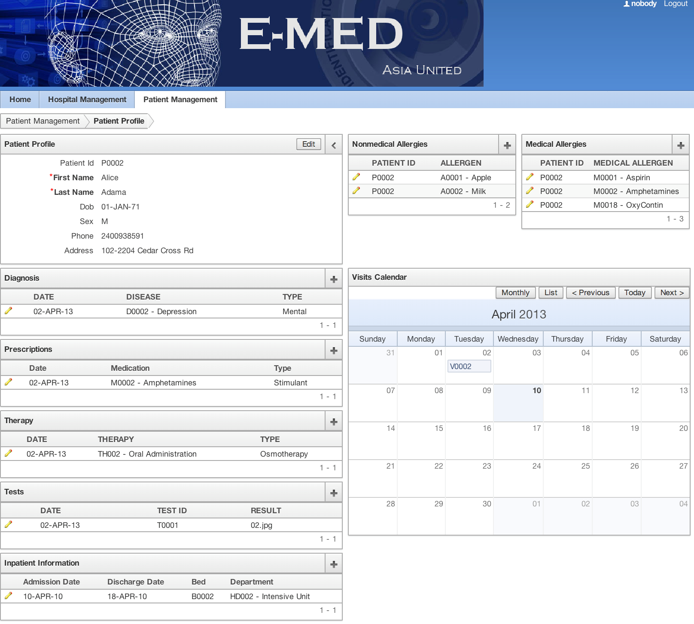

# Medical Information System

+ This is a demo of a medical information intended for a doctor's office. This information system is supported by an SQL database back-end. The system was built on Oracle APEX
+ [appendix.pdf](./appendix.pdf) (excluding title page) includes the sql and plsql used to build the information system. Some features include patient appointment scheduling, drug-drug reaction warnings, and patient information summary including a patient's history.
+ [db_interaction.jpg](./db_interaction.jpg) is the interaction diagram that describes the human computer interaction that
+ [database.sql](./Database.sql) is the sql used to make the database.
 would occur between a medical professional (user) and the information system.
+ [ERD.jpg](./ERD.jpg) is the ERD (Entity Relationship Diagram) that displays the design of the database.
+ More materials to come :)

## System Preview: (Patient Profile)

